# My website

Welcome to the README of my website! :D

I've always seen beautiful websites scattered across the internet and one of my dreams was to have my own.  

So, during the university summer break of 2022, inspired by one of my classes' project and by coursemates websites (like @diogotcorreia [website](https://diogotc.com/) and  @jjasferreira [website](https://github.com/jjasferreira/my-website)) and the beautiful websites I've seen on the web, I decided to learn Web Development and create my personal website!  

Since I had pratically zero experience with web styling, I've documented: 
- a general / technical overview of the website, where I explain stuff like the frameworks used;
- a roadmap that I had previously created some time before starting;
- a "step-by-step" journey / timeline of what I learned, where I learned and how I used what I learned;

This way, I'll help myself by writing down everything I've done and my ideas, as well as other people who intend to create a website themselves and are as lost as I was when I first started.   
I'm obviously no where near a professional, but I'll do my best to explain what I did and the decisions I took.

Here is a table of contents:  
    
- [General Overview](#general-overview)
  * [File Structure](#file-structure)
    + [Outside view](#outside-view)
    + [`Src`](#-src-)
  * [Flow of Code](#flow-of-code)
- [[Roadmap](https://pedro-chaps.notion.site/fazer-website-no-GitHub-3a5ee3f6cff2424784d4042c2617bb54)](#-roadmap--https---pedro-chapsnotionsite-fazer-website-no-github-3a5ee3f6cff2424784d4042c2617bb54-)
- [Timeline of what I did](#timeline-of-what-i-did)
  * [0. My background in WebDev](#0-my-background-in-webdev)
  * [1. The Basics](#1-the-basics)
  * [2. Choosing frameworks](#2-choosing-frameworks)
    + [CSS - Tailwind](#css---tailwind)
    + [Javascript - React](#javascript---react)
  * [3. Learn the frameworks](#3-learn-the-frameworks)
    + [Tailwind](#tailwind)
    + [React](#react)
    + [React-Three-Fiber](#react-three-fiber)
  * [4. Sketch Ideas](#4-sketch-ideas)
  * [5. Navbar](#5-navbar)
  * [6. Header / Home / About me](#6-header---home---about-me)
    + [6.1 Typewritter Effect](#61-typewritter-effect)
  * [7. Low Polly Plane](#7-low-polly-plane)
  * [8. Zoom out text](#8-zoom-out-text)
  * [9. Active Button & Smooth Scroll](#9-active-button---smooth-scroll)
  * [10. Planet Earth](#10-planet-earth)
  * [11. Other planets](#11-other-planets)
  * [12. Animated Avatar](#12-animated-avatar)
  * [13. Multi-Language support](#13-multi-language-support)
  * [14. Different Domain](#14-different-domain)
- [Running Locally](#running-locally)
- [Final thoughts](#final-thoughts)

<small><i><a href='http://ecotrust-canada.github.io/markdown-toc/'>Table of contents generated with markdown-toc</a></i></small>


# General Overview

- The website only has Front-end;
- The Front-end was created using [React](https://reactjs.org/) (for the layout) and [Tailwind](https://tailwindcss.com/) (for the CSS costumization);
- The website's file structure & flow is as follows: 

## File Structure

### Outside view


- `build/` - Has the content that is displayed on the [website](https://chaparro.me);
- `node_modules/` - self explanatory, has the packages used by React and Node;
- `public/` - folder to put assets that are considered "public". For instance, the images that are loaded on the website should be put there (even if the website is not open-source, the visitors can see the images, therefore they are considered public);
- `README_static/` - the images used in this `README`, not part of the actual website;
- `src/` - Where the source code is located, which is different than the `build` folder (because, for instance, compression techniques (minimizing code) are used when deploying the website to a live version);  
- `.gitignore` - files and folders that are not tracked by git (and GitHub). For instance, `/node_modules` is not tracked by git and therefore is not in the [GitHub repository](https://github.com/PedroChaps/pedrochaps.github.io);  
- `babel-plugin-macros.config.js` & `babel.config.js` - Necessary because of [dynamically importing](https://fontawesome.com/docs/web/use-with/react/add-icons) icons from [FontAwesome](https://fontawesome.com/docs/web/use-with/react/);
- `CNAME` - needed because of the custom domain. Better explained in [Section 14](#14-different-domain);
- `package-lock.json` and `package.json` - well explained [here](https://www.geeksforgeeks.org/difference-between-package-json-and-package-lock-json-files/);
- `README.md` - This file!;
- `tailwind.config.js` - Some settings the user can define for Tailwind;  

### `Src`
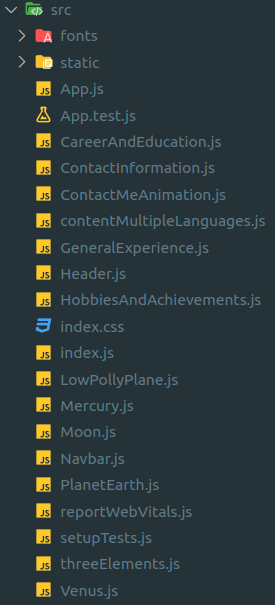

- `fonts/` - holds the fonts used for this website;
- `static/` - has the images used on the website (which could be placed in the public folder);   
- `*.js` - all the components used by React on the website;
- `index.css` holds some css information, like the overall font to be used as well as some packages' styles.

## Flow of Code

Since this is a React application and it was generated using `npx create-react-app`, the workspace follows the template from the script:
- The flow starts in `Index.js`, where the `App.js` component is rendered.  
- Inside `App.js`, you can see that it is divided into multiple components. I've made the division while thinking of the logical structure the website has:  
The website has a **header**, a **navigation bar**, a part that talks about my **career and education**, etc. , therefore I've created a `Header.js`, `Navbar.js`, `CareerAndEducation.js`, etc. .  
- Entering each component, you can then see the respective content.  
Some of the components only have the `html` to be displayed, while others have even more components in order to make the code easier to read, implemented in the React `jsx` way.  

# [Roadmap](https://pedro-chaps.notion.site/fazer-website-no-GitHub-3a5ee3f6cff2424784d4042c2617bb54) 

Before starting, I had already started planning the creation of the website.  
I used Notion to take notes of the steps I wanted to take, the cool ideas I had, the amazing websites I had seen, etc. in order to keep me organized and to not miss anything.  
Most of the notes are in Portuguese because at the time it was the easiest way for me to think.  
You can find the Roadmap [here](https://pedro-chaps.notion.site/fazer-website-no-GitHub-3a5ee3f6cff2424784d4042c2617bb54).

# Timeline of what I did

## 0. My background in WebDev

First, I think it is important to state what my background is in Web Development.  
Before this project, I had only done 2 other projects related to web:  

1. A web app using the Django Framework to interact with APIs.  
    Here I learned the basics of HTML and went straight to Bootstrap without giving a look to CSS, since the main focus was the creating the interaction and not styling the website, so I didn't really learn much.
    
2. A web app using the Flask Framework to interact with a database.  
    One of my classes' project was to do many things related to a database. Since I was the only member of the group with prior experience, I was in charge of the web app that was required.  
    I re-used the same principles of the first app: I used bootstrap for the design and some html "stolen" from the classes slides and, once again, the main objective was using the interaction with the database and not the style itself, so I didn't learn much about styling.
   
## 1. The Basics  

Since my knowledge was really low, I started by learning (or reviewing) the basics: HTML, CSS and JavaScript.  

However, I decided to not put much effort into it - Since I understood the ideas, had some small prior experience and was expecting to use frameworks for CSS and JavaScript, I decided that only reading about the basics would suffice, without really applying what I had learned.  

So, what I did was read the [w3Schools](https://www.w3schools.com/default.asp) guides: [HTML](https://www.w3schools.com/html/default.asp), [CSS](https://www.w3schools.com/css/default.asp) and [JavaScript](https://www.w3schools.com/js/default.asp), by that order.  

## 2. Choosing frameworks

Having read the basics, it was time to choose a framework for CSS and JavaScript.  
Although it wasn't necessary to, I decided that they would most likely help and learning a bit of everything wouldn't hurt, so I forced myself to use frameworks.

### CSS - Tailwind

From the dozens that are available, I was kind of lost on which to use.  
I had already excluded Bootstrap because I wanted to learn something new and Bootstrap wasn't that customizable.  
So by googling a bit and following @jjasferreira 's idea I decided to use Tailwind.  

From what I gathered, Tailwind is highly customizable - it's like writing pure CSS but faster (and not using pre-built complex classes) - but also has some neat features, like Dark Mode, components, etc.  

### Javascript - React  

This was a tough one to choose.  
I'll be honest and say that it was kind of a random choice.  
I had already seen some videos of people using THREE.js for 3D graphics, so I was planning to use it, and since React had a "Reach-Three-Fiber" that is a wrapper for THREE.js, I decided to learn this framework.


## 3. Learn the frameworks

Having chosen the frameworks, it was time to learn them! 
This time I decided to, besides reading, watch videos instead of reading about the content. I watched the following videos and read the following content (in the presented order):  

### Tailwind

- [Firebase Overview](https://www.youtube.com/watch?v=pfaSUYaSgRo) - A good overview of what Tailwind is and how it works;
- [Tailwind Docs](https://tailwindcss.com/docs/installation) - After choosing Tailwind, this was my main way of learning Tailwind, because the Docs are very well written, with good examples!  
I've given a quick read and while coding I would also check the documentation often; 

### React

- [An Introduction to React](https://www.youtube.com/watch?v=hQAHSlTtcmY&list=WL&index=46) - It explains well what React is and how to use it, some of it's hooks and how to start a project with it;
- [React Docs](https://reactjs.org/docs/getting-started.html) - In the same way as Tailwind's, React's documentation is also very good and the resources they suggest are interesting too; 
- [W3Schools React Tutorial](https://www.w3schools.com/REACT/DEFAULT.ASP) - Like Html, CSS and Javascript, React was really well explained here. I prefered reading this tutorial than the oficial Docs;

### React-Three-Fiber

Later into the development of the website, I started using React-Three-Fiber because of 3D graphics. To learn it, I've read: 

- [Firebase Introduction](https://www.youtube.com/watch?v=Q7AOvWpIVHU) - This video really got me thrilled to use THREE.js;
- [THREE.js Docs](https://threejs.org/docs/) - The documentation is also very good and explains the overall idea behind THREE.js;
- [THREE.js Examples](https://threejs.org/examples/#webgl_animation_keyframes) - Besides documentation, the website also includes many examples from which you can learn how they were implemented by reading the source code;
- [An introdution to R3F](https://www.youtube.com/watch?v=9ZEjSxDRIik&t=1s) - Since I'm using React, it includes a wrapper around THREE.js, React-Three-Fiber. This video was the first I watched on R3F and helped me connect both concepts;
- [R3F Docs](https://docs.pmnd.rs/react-three-fiber/getting-started/introduction) - I'm not really a fan of this documentation - I found it hard to follow (maybe because I had no prior experience with React / THREE.js) and it didn't detail every available feature, instead it mentioned how to "translate" some parts of THREE.js into R3F (being more fluent in THREE.js would certainly have helped me);
- ["translating" THREE.js to R3F](https://www.youtube.com/watch?v=wxvSHOrBHbw&t=1205s) - This video explained quite well how to translate some parts of THREE.js to R3F;
- [R3F examples](https://docs.pmnd.rs/react-three-fiber/getting-started/examples) - Since I got a bit lost in the Docs, I decided it would be better to look at examples, like the ones listed in the Docs page as well as others in the [drei](https://github.com/pmndrs/drei)'s page;

## 4. Sketch Ideas

I started sketching some basic ideas of the layout of the website - This is an important step in the making, because it makes your ideas clearer and if it's really complete, you basically just have to "match" the design with what you've drawn. Here are the pictures of what I drew:

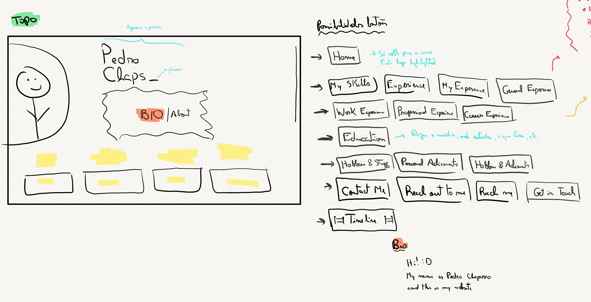

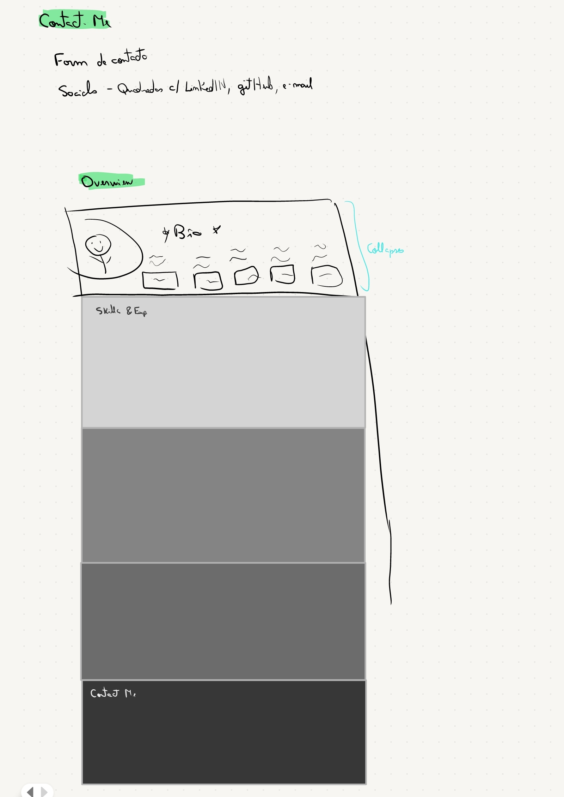
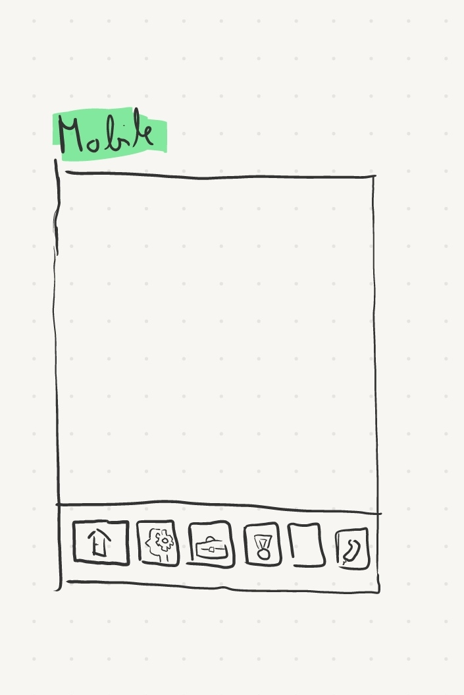
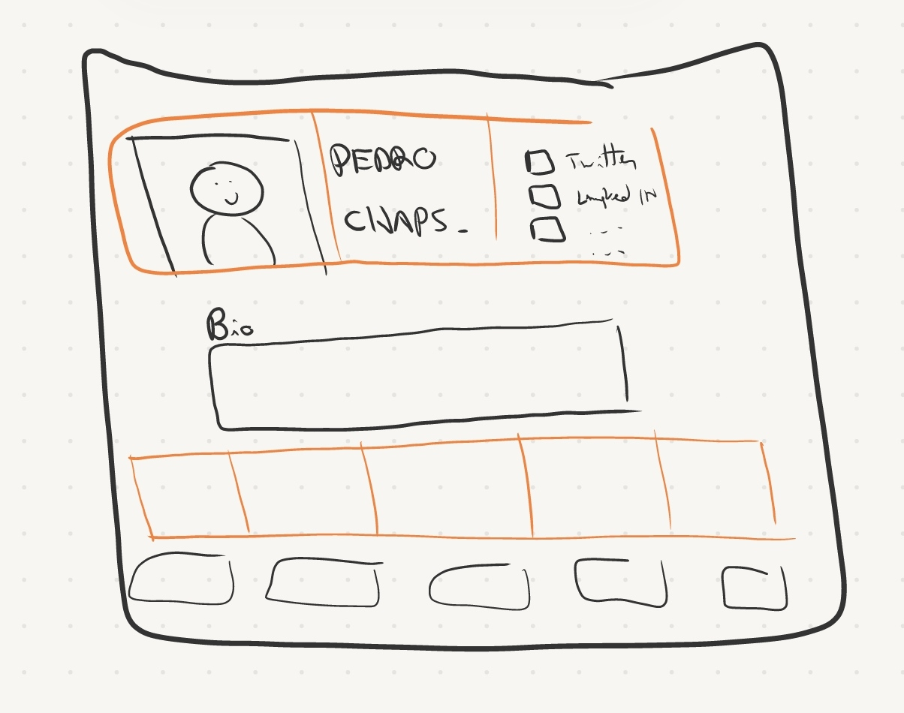
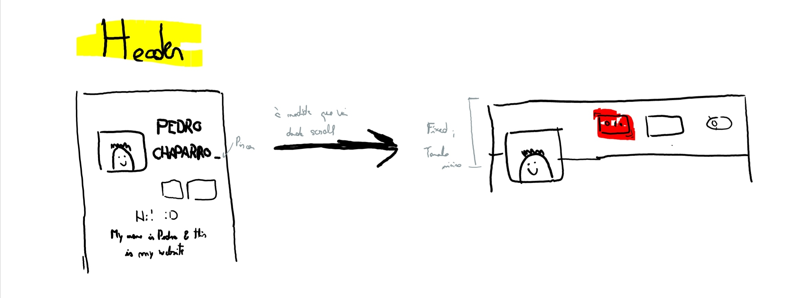


## 5. Navbar  

Now having some theory and ideas set, it was time to start coding!  
I had already some ideas in mind that I had previously thought would look nice, so I started implementing them first.  
The first feature was the **Navbar**.  
I wanted a Navbar that wouldn't look like a Navbar at first but as the user scrolled, it would snap in place, staying at the top of the page - that could be accomplished with the `sticky` class from Tailwind.  
Besides an interactive **Navbar**, I also wanted the buttons in it to look a certain way. I had seen [this video](https://www.youtube.com/watch?v=LSNoRzojcQo)
and I fell in love with the buttons; I had to have something similar on my website!  
So, taking inspiration from the video, the final Navbar was the following:

  


On mobile devices, I thought it was better to just let the Navbar stay fixed at the bottom of the page, because it's more accessible and, since there is less space, I've only put the icons (instead of including the description too).   
So this was the result on mobile:


## 6. Header / Home / About me  

After having the **Navbar**, the next step was creating the **Home** part, which would also be the "About me" part of the website. I had already planned to have four main components:   
1. My name written with a special effect;
2. An image of me (which was later changed to an animated avatar);
3. A small phrase that identifies me;
4. A biography of myself;  

The Navbar would then be at the bottom of the Header, which made it look like it was part of the the Header.  
While I coudn't find a new background, I decided to use a random one I found as a placeholder.  
It ended up looking like this:  


Out of the four components, the most interesting is the first.

### 6.1 Typewriter Effect 

I wanted to have my name written with a special effect.  
I had previously seen a typewriter effect on text, that is, the text starts being written slowly, one letter at a time, like how Typewriters' slowly appear on the piece of paper.  
I started implementing this effect myself but after searching for videos that showed the effect, I stumbled upon [this implementation](https://www.npmjs.com/package/typewriter-effect) that was exactly what I was thinking of!   
So, I decided to use it.  

## 7. Low Polly Plane  

Besides the amazing Navbar, the other feature I really wanted the website to have was a moving Low Polly Plane.  
I had seen this design in many places and I really enjoyed it.  

At first, I was planning to use a video as background, like this one:   
    

but as I was searching THREE.js tutorials on youtube, I stumbled upon this video:     

[](https://www.youtube.com/watch?v=YK1Sw_hnm58)  

And it was EXACTLY what I was looking for: An animated Low Polly Plane that even had mouse interaction!  
So, I took a big inspiration from it and created a very similar version.  
Note that the implementation above uses [THREE.js](https://threejs.org/) while what I did was with [React-Thee-Fiber](https://github.com/pmndrs/react-three-fiber), a React wrapper of THREE.js, which means that if look at the code I wrote, it will look very different than what in the video.

At first, this plane was the background of the General Experience tab, but it was later moved.  
Here are some screenshots of it:
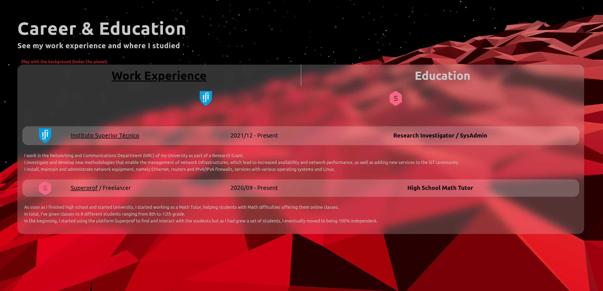  
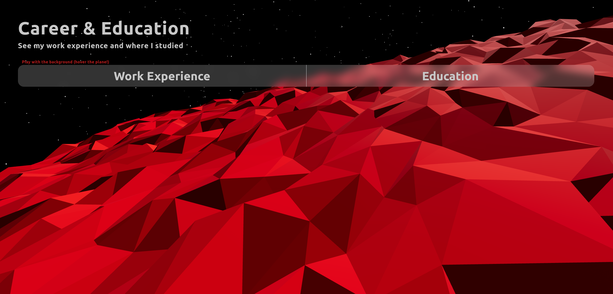   


## 8. Zoom out text
While creating the plane, an idea of zooming out from a piece of text appeared in my mind.    

I thought it would look cool at the end of the website, asking the user if he liked what he saw and then presenting the ways he could contact me (and other final information).  
The way I did it was by getting the user's current scroll position and changing the position of the text based on the scroll value (that is, the z-position of the text was a function of the scroll position).      
To generate the text inside a Canvas, I used [Drei's 3D text](https://github.com/pmndrs/drei#text3d).  

I then also added some lighting changes as the user continued scrolling, in order to make it even more interactive!   

This was the final result, in different stages:

   
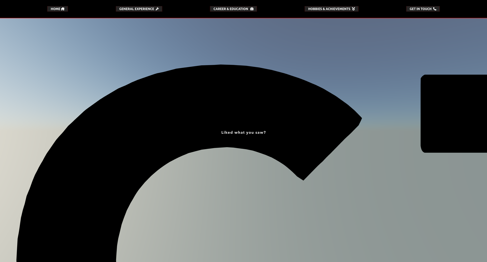   
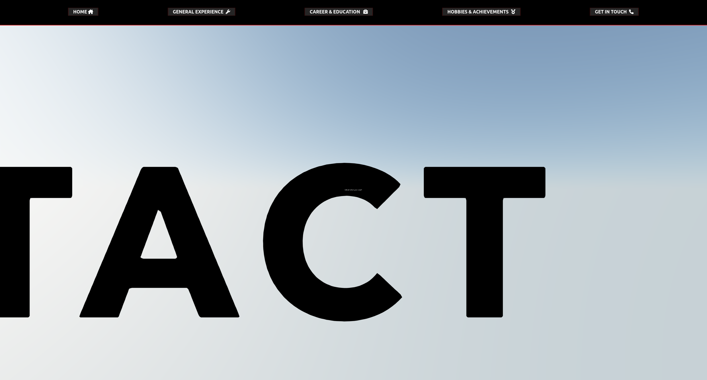   
   
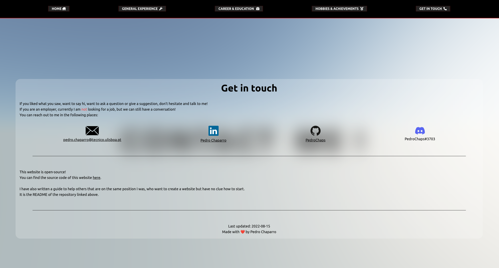   

## 9. Active Button & Smooth Scroll

Currently I had a Navbar and some content BUT the buttons on it didn't do anything!  
I wanted them to besides taking the user to the appropriate section, do it smoothly. I also wanted the current section's button to light up once the user enters it. 

While googling the best way to implement this, I was lucky to find this [amazing video](https://www.youtube.com/watch?v=QzW03hyw_bU) that uses the [react-scroll package](https://www.npmjs.com/package/react-scroll) and explains exactly how to implement what I wanted.

The buttons started looking like this:
  


## 10. Planet Earth
Note that up until this point I didn't really have a theme for my website.  

I just knew that I wanted an interactive Navbar with those gorgeous buttons and that I wanted a Low Polly moving Plane but at this point I didn't know what to do next: I didn't want to include random stuff on the website just because it looked cool. It needed to have some meaning.  

After thinking and looking at other people's websites, I found this [interesting package](https://www.npmjs.com/package/react-globe.gl?activeTab=dependents) that implemented a Globe and had many interesting visualization features.  
One of the features was using HTML in the globe, which could be used to put markers in specific coordinates, as shown in [this example](https://vasturiano.github.io/react-globe.gl/example/html-markers/).  

With that, I had an interesting idea: I could use this globe in the **Hobbies and Achivements** section and mark the countries I have visited.

Then, I had an amazing idea: 
> What if that *random* plane was actually the zoomed-in surface of the Earth and as the user scrolled, the plane would zoom out and the plane would appear?  

That sounded AMAZING in my head and could just well be the theme of the website - **Space**! 

I created a texture that looked like the geometry used on the plane and used it on the planet:  

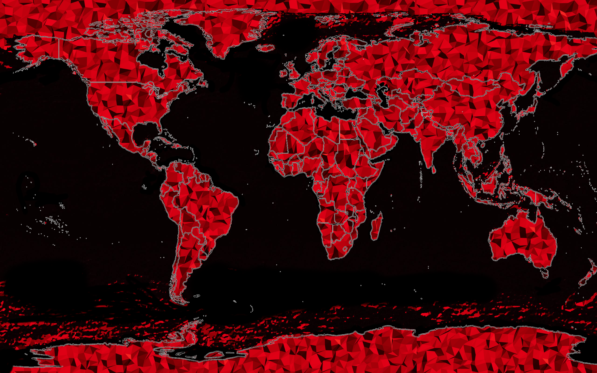

Then I found [this package](https://www.npmjs.com/package/react-scroll-percentage) that easily tells the user's current scroll position across some part or all of the document.  
As soon as the user crossed a certain threshold, the plane would start moving down and the animation of the Earth would kick in, zooming out of the planet.  

Even though it's clear where the Plane and the Globe separate, I think it's fluid enough if the user is scrolling smoothly. I'm very happy with the result! : 

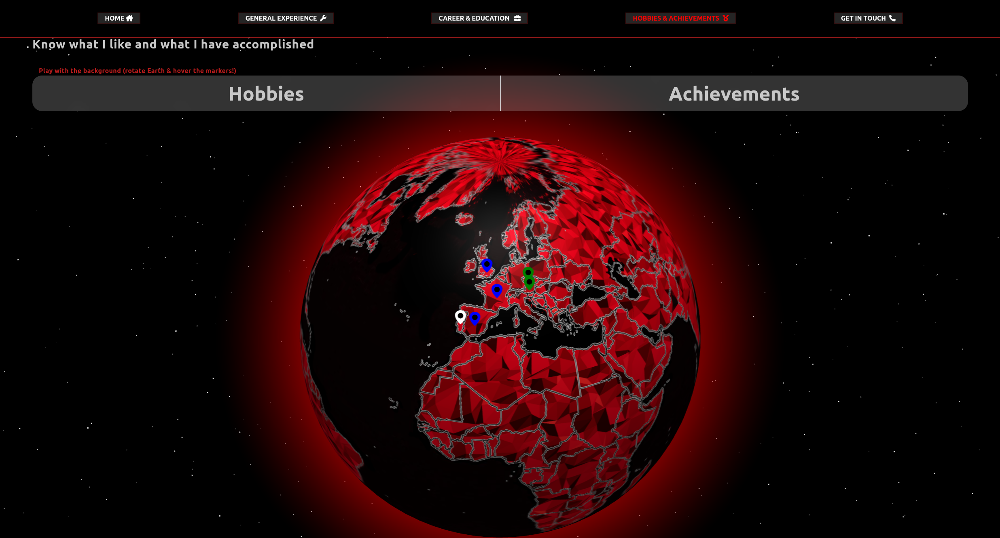  

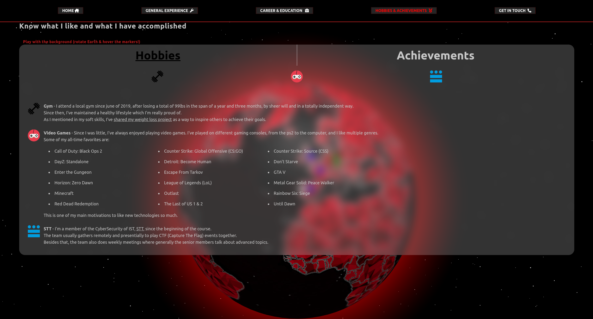

Sadly, this component was too resource-heavy and some mobiles couldn't handle it - they would either crash the webpage or glitch every element out.  
That meant I had to remove the globe :(  
To substitute it, I made a little joke:

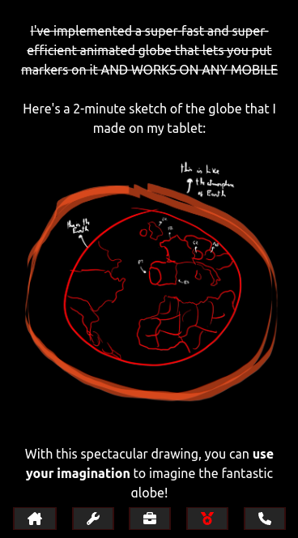

## 11. Other planets 

Because of the previous idea, I needed to move the Plane to the **Career and Education** section. That meant the **General Experience** section was currently empty.   

Since the theme (**Space**) was now defined, I thought it was nice to include the planets that come before Earth in the Solar System as well as the Moon flying across the plane - it would make sense theme-wise and I could play a bit with the animations.     

So, I added Mercury, Venus and the Moon and some reaction to the scroll movement:
- Mercury and Venus rotate as the user scrolls;
- The Moon rotates and moves across the plane, as if it was orbiting Earth. 

This was nothing special compared to the Plane or the Globe, just three R3F meshes of which the rotation/position depends on the scroll percentage of the website.

This reaction makes the website a bit more interactive, which is always welcome!

It ended up looking like this:  

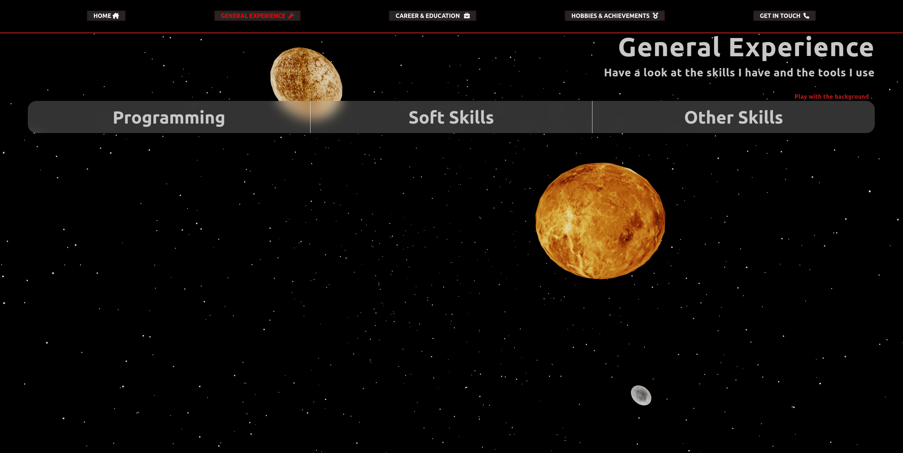   

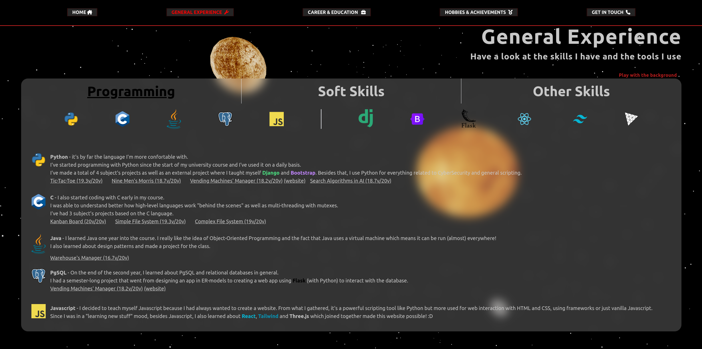

## 12. Animated Avatar

While looking for ideas, I found this [really cool article](https://dev.to/nourdinedev/how-to-use-threejs-and-react-to-render-a-3d-model-of-your-self-4kkf) that explains how you can create an Avatar of yourself, animate it and use it on your website.  

I thought an animated Avatar would look more interesting than a photo of myself, so I decided to switch the photo I previously had.  
My avatar ended up looking like this:  

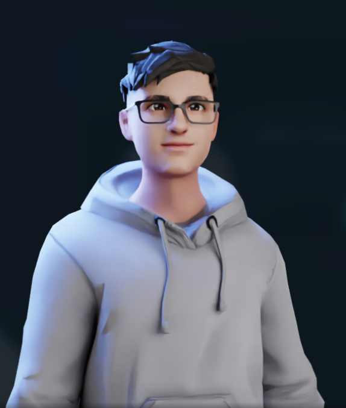

However, after looking at the avatar in the website, I thought it just didn't fit and that it was just too much.  
So I decided to try something simpler and tried Snapchat's avatar. I preferred it over the previous one, so I kept it and decided to add some animation!    

I put the avatar in a box that, when hovered, made the avatar change to another stance (by switching the image) and, by using [this package](https://www.npmjs.com/package/use-3d-effect), tilted the avatar in the direction of where the mouse was (as if the mouse was pushing the box).

The final result was this:  
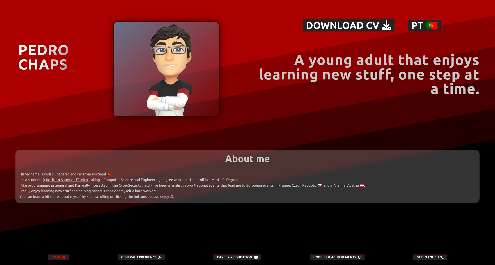  


## 13. Multi-Language support

I also wanted the website to have two languages - Portuguese, my native language, and English, the *technology* and global language.  
To do this, I googled the best way to do it and saw multiple approaches, like [react-i18next](https://react.i18next.com/).  
However, since I was sure I would only need two languages, I went for something more simple and followed [this guide](https://www.techomoro.com/how-to-create-a-simple-multi-language-website-with-react/) I had found.    

Basically, instead of having the content of the page inside the `html`/`jsx`, it is saved in a variable (or in multiple files / just a file, in my case), which has the content in multiple languages, stored in an object of objects, all with the same name.  
When the user clicks the button to change the language, the object from which the content is being read changes to the appropriate language. For instance, consider this *pseudo-code* 
```javascript
let contentAllLanguages = {
    English: {
        Header: "A young adult"
    },
    Portuguese: {
        Header: "Um jovem adulto"
    }
}

let content = {ButtonIsClicked ? contentAllLanguages.English : contentAllLanguages.Portuguese}

console.log(content.Header)
```
there is a `Header` for each language, which has the content of the `Header`, translated in the corresponding language.  
Depending on the state of the button, the origin of the `content` variable is different.  

Another neat feature is that the last state of the button is saved in the local storage of the browser.  
So, if the user refreshes the page, the presented language will be the same as before the update.

## 14. Different Domain 

Finally, I wanted to have an unique link for the website!  
I decided to use [Namecheap](https://www.namecheap.com/) to get a custom domain: `chaparro.me` .  
Since I am using **GitHub Pages** to host the website, I could use [this guide](https://www.namecheap.com/support/knowledgebase/article.aspx/9645/2208/how-do-i-link-my-domain-to-github-pages/) that explains how to link the domain to the GitHub page.  
Even though it's not mentioned in that guide, I also needed to make some changes in the GitHub repository. What is necessary to do is explained [here](https://docs.github.com/en/pages/configuring-a-custom-domain-for-your-github-pages-site/managing-a-custom-domain-for-your-github-pages-site).  
Finally, since I'm using [gh-pages](https://www.npmjs.com/package/gh-pages) to easily publish the files, I needed to alter the `npm run deploy` script to create a `CNAME` file.   
It is explained [here](https://stackoverflow.com/questions/72679906/cname-file-not-copied-in-gh-pages-branch-after-npm-run-deploy) on the first comment (or just go to the [gh-pages docs](https://www.npmjs.com/package/gh-pages) and do what is under the ***Deploying to github pages with custom domain*** section).

# Running Locally

It is very simple to run this project on your machine!  
If it is the first time running the project (You need to have [npm installed](https://linuxize.com/post/how-to-install-node-js-on-ubuntu-20-04/) on your machine):  

1. Clone this repository: `git clone https://github.com/PedroChaps/pedrochaps.github.io` ;
2. Go to the directory: `cd pedrochaps.github.io` ;
3. Type `npm install` - this will install all the packages used in the application;
4. Type `npm run start`- this will start the application locally;
5. Finally, access the web app by accessing the following link in a browser: `localhost:3000`. 

If you have already run the project, you just need to do steps 4. and 5. on the following times.

# Final thoughts

I hope you have liked my website and this README!  
If you have any doubts, questions, comments or suggestions, don't hesitate to contact me - I'm very happy to help! :D